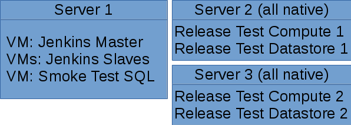

---

# Docker - Starting at Small Scale

### Patrick Santos @patrickceg

Larus Technologies

---

### Overview

* My Use Case
* Why get started with Docker
  * When already using/considering Virtual Machines (VMs)
* How I started
* Demos

---

### What is Docker


> <sub>[1]</sub>

+++

> Containers are a way to package software in a format that can run isolated on a shared operating system. Unlike VMs, containers do not bundle a full operating system - only libraries and settings required to make the software work are needed. [1]

---

### My use case

* Servers on-site, some small (< 3) cloud machines

* Not a cluster, but Docker still helps:
  * More efficient than 1 VM per service
  * Quick setup / teardown (great for demos)
  * "Works on my machine" solution

---

### I have VMs, so why Docker?

* Keep using your VMs: Docker works with them
* More space efficient than VMs:
  * 30% less disk, 7% less RAM, 25% less CPU [2]
* Large selection of images
  * https://hub.docker.com/
  * https://store.docker.com/

---

### How I started

1. Install Docker machine: https://store.docker.com/search?type=edition&offering=community
2. Play around / learn: https://github.com/docker/labs
3. Find something to “Dockerize”

---

### Finding a ~~victim~~ / candidate (1)



+++

### Finding a ~~victim~~ / candidate (2)

* Not in production!
* Docker image available
* Ephemeral (little to no state)

---

# Demo: Basic Linux Container

* Omit the _sudo_ calls from samples if running Docker for Windows or don't otherwise use sudo

+++

* Start a Docker container with Ubuntu:

```
sudo docker run -it ubuntu:16.04 /bin/bash
```

* From inside the container, see what's inside:

```
ls
```

+++

* Now let's check the disk space by the container

```
sudo docker system df
```

* Less than 200 MB, compared to 1.2 GB for a Ubuntu 16.04 VM installed from Mini ISO

* ...and the RAM used by a container

```
sudo docker stats
```

* Hundreds of KB vs usually hundreds of MB for a VM

---

# Demo: PostgreSQL Database Container

See [4]: https://hub.docker.com/_/postgres/

+++

### From the instructions [4]:

* Docker images have detailed instructions on Docker Hub or Github

> How to use this image
> start a postgres instance

```
docker run --name some-postgres -e POSTGRES_PASSWORD=mysecretpassword -d postgres
```

+++

* Modifying the examples to spin a container...

```
sudo docker run --name myunsafedb -p 40000:5432 -e POSTGRES_PASSWORD=admin -d postgres:9.6
```
* *-p 40000:5432*: Exposed the port for other machines to access the database with the machine's port 40000
* *postgres:9.6*: Select a version to use (or else you always get the latest)
* Most popular password in recent article :)  [5] 

+++

* Container is accessible at port 40000 (can check with port scan)

```
nmap -p 40000 localhost
```

* If container is inaccessible, check firewall
* We can also check the Docker container itself:

```
sudo docker inspect myunsafedb
```

+++

* If we destroy the container and recreate it, the data is lost:

```
sudo docker rm -f myunsafedb
sudo docker run --name myunsafedb -p 40000:5432 -e POSTGRES_PASSWORD=admin -d postgres:9.6
```

+++

* To persist the data, you want _volumes_, but test thoroughly! 
  * Writing to the wrong place (not in the volume)
  * Improper file permissions in the volume (hopefully the app crashes instead of pretending to work)
  * Recreated container but data was clobbered

---

### How it worked / future work

* All smoke test / release test software runs on Docker containers
  * Containers run in VMs
  * Easier to set up or reconfigure nodes
* Helps a lot in testing
  * Test "crashing" a service? No problem!
* Starting to get into clusters

---

References

```
[1] Docker. 2017. What is a Container. Retrieved Aug. 29, 2017. https://www.docker.com/what-container
[2] Mike Coleman. 2017. Docker?!? But I'm a SYSADMIN! Retrieved Aug. 11, 2017, from https://youtu.be/M7ZBF-JJWVU
[3] Docker. 2017. Running your first container. Retrieved Aug. 16, 2017, from https://github.com/docker/labs/blob/master/beginner/chapters/alpine.md
[4] Docker. 2017. postgres. Retrieved Aug. 16, 2017, from https://store.docker.com/images/postgres
[5] Dan Goodin. Leak of >1,7000 valid passwords could make the IoT mess much worse. Retrieved Aug. 27, from https://arstechnica.com/information-technology/2017/08/leak-of-1700-valid-passwords-could-make-the-iot-mess-much-worse/
```

---

END